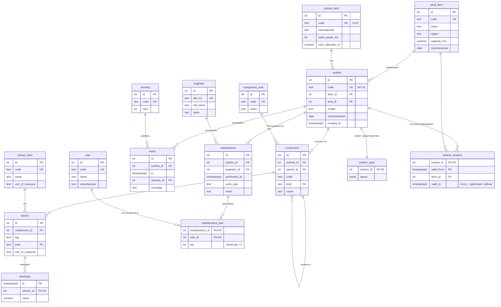

# Проект: Ветропарк (ветроэнергетическая станция)

**Команда:** Данилов А.Д., <добавьте остальных>
**Предметная область:** энергетика — ветропарк
**Объект наблюдения:** ветроэнергетическая установка (ВЭУ) и её узлы
**Схема в БД:** `project` (в базе `plant`, рядом с учебным датасетом в `public`)

## Сущности

| Сущность | PK / UK | Атрибуты | Источник |
|---|---|---|---|
| `wind_farm` | id PK, code UK | name, region, capacity_mw, commissioned | V1 |
| `turbine` | id PK, code UK | farm_id FK, kind_id FK, model, commissioned, created_at | V1 |
| `turbine_kind` | id PK, code UK | manufacturer, rated_power_kw, rotor_diameter_m | V1 |
| `component` | id PK, (turbine_id, code) UK | turbine_id FK, parent_id FK (self), kind FK, name | V1 |
| `component_kind` | id PK, code UK | name | V1 |
| `sensor` | id PK, (component_id, tag) UK | component_id FK, kind FK, unit_of_measure | V1 |
| `sensor_kind` | id PK, code UK | name, unit_of_measure | V1 |
| `telemetry` | (ts, sensor_id) PK | value | V1 |
| `event` | id PK | turbine_id FK, ts, severity_id FK, message | V1 |
| `severity` | id PK, code UK | rank (1–4) | V1 |
| `engineer` | id PK, tab_no UK | full_name, team | V1 |
| `part` | id PK, code UK | name, manufacturer | V1 |
| `maintenance` | id PK | turbine_id FK, engineer_id FK, performed_at, work_type, notes | V1 |
| `maintenance_part` | (maintenance_id, part_id) PK | qty (CHECK > 0) | V1 |
| `turbine_spec` | turbine_id PK, FK | specs (jsonb) | V2 |
| `turbine_location` | (turbine_id, valid_from) PK | farm_id FK, valid_to | V2 |

## Связи

- `wind_farm` — `turbine`: 1:N, обязательна (каждая турбина привязана к площадке).
- `turbine_kind` — `turbine`: 1:N, обязательна (у турбины есть модель из справочника).
- `turbine` — `component`: 1:N, обязательна (узлы турбины).
- `component` — `component`: 1:N через `parent_id` (дерево состава, самоссылка).
- `component_kind` — `component`: 1:N, обязательна.
- `component` — `sensor`: 1:N, необязательна (не на каждом узле есть датчик).
- `sensor_kind` — `sensor`: 1:N, обязательна.
- `sensor` — `telemetry`: 1:N, обязательна (у датчика много измерений).
- `turbine` — `event`: 1:N, обязательна.
- `severity` — `event`: 1:N, обязательна (уровень — справочник).
- `turbine` — `maintenance`: 1:N, обязательна.
- `engineer` — `maintenance`: 1:N, обязательна.
- `maintenance` — `part`: **M:N** через `maintenance_part`, атрибут связи — `qty`.
- `turbine` — `turbine_spec`: 1:1, необязательна (характеристики в jsonb).
- `turbine` — `turbine_location`: 1:N (история размещения турбины).
- `wind_farm` — `turbine_location`: 1:N.

## Что меняется во времени

- **Размещение турбины** — таблица `turbine_location` с `valid_from` / `valid_to`. `valid_to IS NULL` = действует сейчас. Гарантия «не более одной действующей записи на турбину» — частичный уникальный индекс `turbine_location_one_current` (в V2).
- **Пороги срабатывания датчиков** — в `turbine_spec.specs` (jsonb): `limits.temp.warning`, `limits.temp.alarm`.
- **Ответственные инженеры** — история через `maintenance.engineer_id` + `performed_at`.

## Условные обозначения ER-диаграммы

- `||` — ровно один;
- `o{` — ноль или много;
- `|{` — один или много.

M:N-связь `maintenance — part` разрешена через таблицу `maintenance_part` с составным первичным ключом и атрибутом `qty`.

## Как применить схему

### Способ 1 (основной, не требует Makefile)

```bash
docker compose exec postgres psql -U student -d plant -c "drop schema if exists project cascade;"

docker compose exec -T postgres psql -U student -d plant -v ON_ERROR_STOP=1 \
  < seminar02/migrations/V1__init.sql
docker compose exec -T postgres psql -U student -d plant -v ON_ERROR_STOP=1 \
  < seminar02/migrations/V2__spec_and_location.sql

docker compose exec postgres psql -U student -d plant -c "\dt project.*"
```

Ожидаемо — 16 таблиц в схеме `project`.

### Способ 2 (если в Makefile есть цель migrate)

```bash
make migrate
make migrate-reset
```

Если `make migrate` выдаёт `No rule to make target 'migrate'` — цели в вашем `Makefile` нет, используйте способ 1.

## ER-диаграмма

